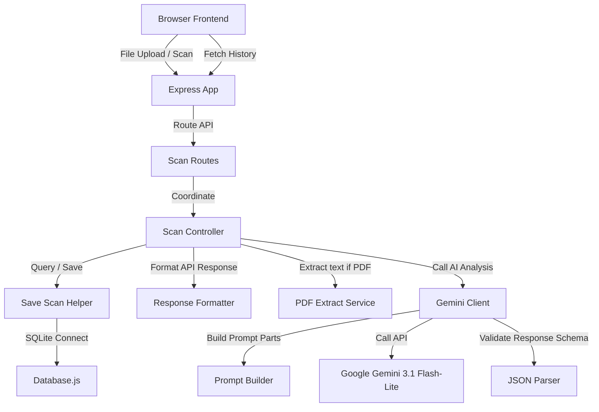

# LoanLens AI

Understand your loan before you sign.

I built LoanLens AI to help borrowers analyze loan agreements, calculate true effective APR, identify red flags, and obtain automated negotiation recommendations using Google Gemini.

## Problem
Loan agreements are often lengthy, filled with complex legal jargon, and can contain hidden charges or unfavorable clauses that are difficult for average consumers to spot. Lenders might state a low interest rate, but hidden processing fees, interest compounding structures, or penalty terms can result in a much higher effective APR.

## Solution
LoanLens AI provides an easy-to-use platform where users can drag and drop their loan documents (PDFs or images). The application extracts text, queries the Gemini API for a structured breakdown, estimates true APR, flags warning clauses with severity levels, generates suggestions for negotiation, and provides a clear sign-off verdict.

## Features
- **Hero Landing Panel**: Quick access to the core value proposition and fast navigation to scan or check history.
- **Drag & Drop Upload Zone**: Modern file input zone supporting PDF, JPEG, and PNG.
- **AI Processing Animation**: Step-by-step sequential feedback checklist that updates as the document is analyzed.
- **Dynamic Health Meter**: Visual health progress indicators based on warning flags.
- **APR Comparison Charts**: Side-by-side comparison of stated rate vs effective APR.
- **AI Sign-off Verdict**: A clear recommendation on whether the user should proceed, exercise caution, or avoid the contract.
- **Downloadable Print Reports**: Dedicated print stylesheets to print a clean document report.
- **Filterable History Dashboard**: A grid-card view of past scans, filterable by risk levels and searchable by name, with quick aggregate stats.
- **Try Sample Documents**: Preloaded mock document buttons for fast judging.
- **Dark Mode Switch**: Fully integrated color theme toggle.

## System Architecture
The application is structured as a decoupled Node.js/Express backend and a vanilla HTML/CSS/Bootstrap 5 frontend.



## Folder Structure
```text
LoanLensAI/
├── client/
│   ├── assets/
│   │   ├── car_loan.png
│   │   ├── education_loan.png
│   │   └── personal_loan.png
│   ├── css/
│   │   └── style.css
│   ├── js/
│   │   ├── app.js
│   │   ├── history.js
│   │   └── renderShared.js
│   ├── index.html
│   └── history.html
├── server/
│   ├── config/
│   │   ├── constants.js
│   │   ├── dbConfig.js
│   │   └── geminiConfig.js
│   ├── controllers/
│   │   ├── responseFormatter.js
│   │   ├── saveScan.js
│   │   └── scanController.js
│   ├── database/
│   │   ├── database.js
│   │   └── initDb.js
│   ├── middleware/
│   │   └── uploadMiddleware.js
│   ├── routes/
│   │   └── scanRoutes.js
│   ├── services/
│   │   ├── extractPdfText.js
│   │   ├── geminiClient.js
│   │   ├── jsonParser.js
│   │   └── promptBuilder.js
│   ├── utils/
│   │   └── .gitkeep
│   ├── uploads/
│   │   └── .gitkeep
│   └── app.js
├── .env.example
├── .gitignore
├── package.json
└── README.md
```

## API Endpoints

### 1. Submit Scan
- **Endpoint**: `POST /api/scan`
- **Payload**: Multipart file upload (`file` key containing PDF, JPG, or PNG)
- **Output**: JSON payload containing the formatted report, health scores, list of red flags, and tips.

### 2. List History
- **Endpoint**: `GET /api/scans`
- **Output**: Array of past scans containing ID, filename, risk score, date, loan type, and health metrics.

### 3. Fetch Scan Details
- **Endpoint**: `GET /api/scans/:id`
- **Output**: Full detailed JSON log of the scan.

## Deployment Guide (Render)

### Free Tier Deployment
1. Create a new Web Service on Render pointing to your repository.
2. Select Node runtime.
3. Use `npm install` for the Build Command, and `node server/server.js` for the Start Command.
4. Add environment variable `GEMINI_API_KEY` containing your Google AI Studio key.

### Persistent Database Deployment (Starter Tier)
1. Add a Persistent Disk on Render with Mount Path `/data`.
2. Configure environment variable `DATABASE_PATH` with value `/data/database.db`.

## Future Scope
- **Agentic AI Extension**: The decoupled prompt building and JSON parsing services make it easy to migrate to an agentic loop, such as a self-correcting prompt engine.
- **OCR Enhancements**: Implement tesseract-based localized OCR fallback when documents contain unreadable text.
- **Contract Version Diffing**: Add capability to compare different contract versions to highlight changes made during renegotiations.
