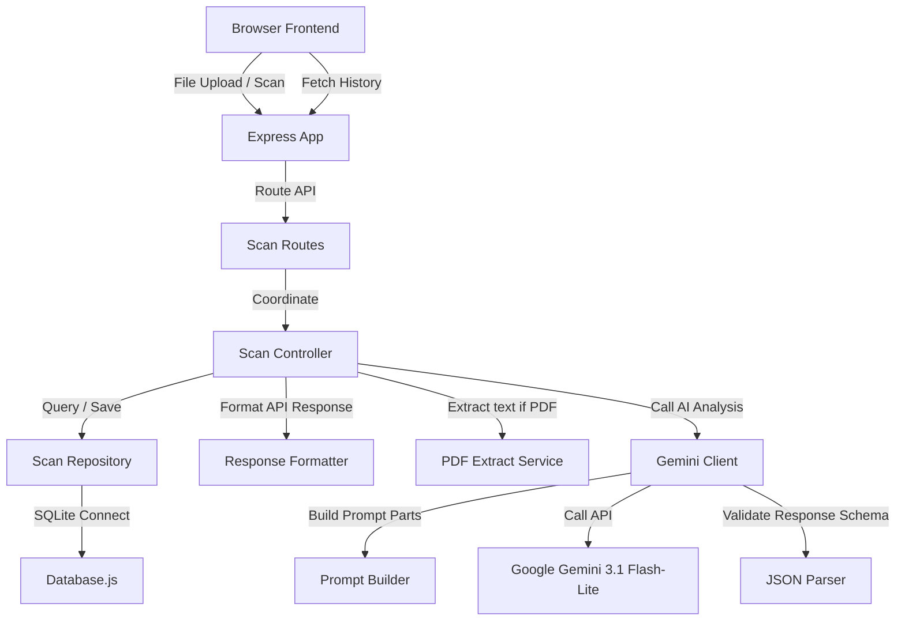

# LoanLens AI

AI-powered loan agreement analyzer that helps borrowers understand hidden risks before signing.

Built for AI Hackathon 2026.

I built LoanLens AI to help borrowers analyze loan agreements, calculate true effective APR, identify red flags, and obtain automated negotiation recommendations using Google Gemini.

## Problem
I noticed that loan agreements are often lengthy, filled with complex legal jargon, and can contain hidden charges or unfavorable clauses that are difficult for average consumers to spot. Lenders might state a low interest rate, but hidden processing fees, interest compounding structures, or penalty terms can result in a much higher effective APR.

## Solution
I created LoanLens AI to provide an easy-to-use platform where I can upload loan documents (PDFs or images). The application extracts text, queries the Gemini API for a structured breakdown, estimates true APR, flags warning clauses with severity levels, generates suggestions for negotiation, and provides a clear sign-off verdict.

## Features
- **Hero Landing Panel**: Quick access to the core value proposition and fast navigation to scan or check history.
- **Drag & Drop Upload Zone**: Modern file input zone supporting PDF, JPEG, and PNG.
- **AI Processing Animation**: Step-by-step sequential feedback checklist that updates as the document is analyzed.
- **Dynamic Health Meter**: Visual health progress indicators based on warning flags.
- **APR Comparison Charts**: Side-by-side comparison of stated rate vs effective APR.
- **AI Sign-off Verdict**: A clear recommendation on whether the user should proceed, exercise caution, or avoid the contract.
- **Downloadable Print Reports**: Dedicated print stylesheets to print a clean document report.
- **Filterable History Dashboard**: A grid-card view of past scans, showing Loan Type, Verdict, and calculated Health Score, filterable by risk levels and searchable by name, with quick aggregate stats.
- **Try Sample Documents**: Preloaded fictional PDF documents for fast judging.
- **Dark Mode Switch**: Fully integrated color theme toggle.

## Demo

Sample loan agreements are included for quick evaluation.

- safe_home_loan.pdf → Low Risk
- education_loan.pdf → Medium Risk
- predatory_personal_loan.pdf → Predatory Risk

These documents are fictional and created only for demonstration purposes.

## Tech Stack

Frontend
- HTML
- Bootstrap 5
- Vanilla JavaScript

Backend
- Node.js
- Express.js

Database
- SQLite

AI
- Google Gemini Flash Lite

Deployment
- Render

## System Architecture
I structured the application as a decoupled Node.js/Express backend and a vanilla HTML/CSS/Bootstrap 5 frontend. I use SQLite for local database persistence, checking and applying migrations dynamically on startup.



## Folder Structure
I organized the repository as follows:
```text
LoanLensAI/
├── client/
│   ├── assets/
│   │   ├── education_loan.pdf
│   │   ├── predatory_personal_loan.pdf
│   │   └── safe_home_loan.pdf
│   ├── css/
│   │   └── style.css
│   ├── js/
│   │   ├── app.js
│   │   ├── history.js
│   │   ├── renderVerdictCard.js
│   │   ├── renderAprBars.js
│   │   ├── renderRedFlags.js
│   │   ├── renderNegotiationTips.js
│   │   └── renderLoanReport.js
│   ├── index.html
│   └── history.html
├── demo-documents/
│   ├── education_loan.pdf
│   ├── predatory_personal_loan.pdf
│   └── safe_home_loan.pdf
├── server/
│   ├── config/
│   │   ├── constants.js
│   │   ├── dbConfig.js
│   │   └── geminiConfig.js
│   ├── controllers/
│   │   └── scanController.js
│   ├── database/
│   │   ├── database.js
│   │   ├── initDb.js
│   │   └── scanRepository.js
│   ├── middleware/
│   │   └── uploadMiddleware.js
│   ├── routes/
│   │   └── scanRoutes.js
│   ├── services/
│   │   ├── extractPdfText.js
│   │   ├── geminiClient.js
│   │   ├── jsonParser.js
│   │   └── promptBuilder.js
│   ├── utils/
│   │   └── responseFormatter.js
│   └── app.js
├── .env.example
├── .gitignore
├── package.json
└── README.md
```

## API Endpoints

### 1. Submit Scan
- **Endpoint**: `POST /api/scan`
- **Payload**: Multipart file upload (`file` key containing PDF, JPG, or PNG)
- **Output**: JSON payload containing the formatted report, health scores, list of red flags, and tips.

### 2. List History
- **Endpoint**: `GET /api/scans`
- **Output**: Array of past scans containing ID, filename, risk score, date, loan type, verdict, verdict reason, and health metrics.

### 3. Fetch Scan Details
- **Endpoint**: `GET /api/scans/:id`
- **Output**: Full detailed JSON log of the scan.

## Installation

I install and configure the application locally using the following steps:
1. Clone the repository to the local environment.
2. In the root directory, install all required dependencies:
   ```bash
   npm install
   ```
3. Set up the environment variables. Create a `.env` file in the root directory based on the `.env.example` file:
   ```env
   PORT=3050
   GEMINI_API_KEY=your_gemini_api_key_here
   DATABASE_PATH=database.db
   ```
4. Run the application:
   - For production:
     ```bash
     npm start
     ```
   - For development (utilizing nodemon):
     ```bash
     npm run dev
     ```

## Deployment Guide (Render)

### Free Tier Deployment
1. I create a new Web Service on Render pointing to my repository.
2. I select Node runtime.
3. I use `npm install` for the Build Command, and `node server/server.js` for the Start Command.
4. I add the environment variable `GEMINI_API_KEY` containing my Google AI Studio key.

### Persistent Database Deployment (Starter Tier)
1. I add a Persistent Disk on Render with Mount Path `/data`.
2. I configure the environment variable `DATABASE_PATH` with value `/data/database.db` to prevent sqlite data from resetting on deployment restarts.

## Demo Steps

I created a `/demo-documents` folder containing fictional PDF documents to showcase the capabilities of LoanLens AI. I can download these files and manually upload them, or use the "Try Sample Documents" buttons on the scan page.

1. **Safe Home Loan (`safe_home_loan.pdf`)**
   - **How to test**: Click on the "Safe Home Loan" button or upload the PDF from the `/demo-documents` directory.
   - **Expected Result**: This is classified as a **Home Loan** with **Low Risk** and a **Health Score above 90%** (e.g. 95% or 100%). The verdict will recommend proceeding, showing clear interest rates and no predatory clauses.

2. **Education Loan (`education_loan.pdf`)**
   - **How to test**: Click on the "Education Loan" button or upload the PDF from the `/demo-documents` directory.
   - **Expected Result**: This is classified as an **Education Loan** with **Medium Risk** and a **Health Score between 60% and 70%**. The verdict will recommend reading carefully, flagging late fees and prepayment restrictions.

3. **Predatory Personal Loan (`predatory_personal_loan.pdf`)**
   - **How to test**: Click on the "Predatory Personal Loan" button or upload the PDF from the `/demo-documents` directory.
   - **Expected Result**: This is classified as a **Personal Loan** with **Predatory Risk** and a **Health Score between 10% and 20%** (minimum 10-15%). The verdict will advise avoiding the loan, flagging confessions of judgment, weekly compound interest, and auto-debit rules.

## Future Scope

- OCR improvements
- Support for regional languages
- Bank policy comparison
- Loan recommendation engine
- Financial chatbot
