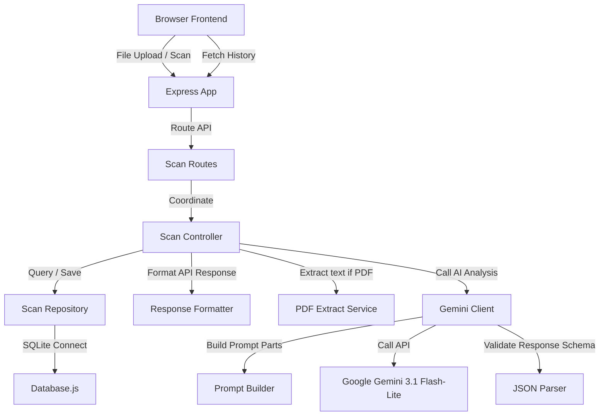

# LoanLens AI

An AI-powered loan agreement analyzer that helps borrowers identify hidden risks, understand complex loan terms, and make informed financial decisions before signing.

> Built as a prototype for an AI Hackathon 2026 submission using Node.js, Express, SQLite and Google Gemini Flash Lite.

## Live Demo

**Application:** https://loanlens-ai.onrender.com

**GitHub Repository:** https://github.com/md-abidhussain/LoanLensAI

## Problem

Loan agreements often contain legal language, hidden fees, complex repayment structures, and penalty clauses that are difficult for ordinary borrowers to understand.

As a result, borrowers may unknowingly accept unfavorable financial terms.

## Solution

LoanLens AI allows users to upload a loan agreement in PDF or image format.

The application extracts document text, analyzes it using Google Gemini, identifies risky clauses, estimates the effective APR, calculates a loan health score, and provides negotiation suggestions in plain language.

## Features

- Upload PDF / Image loan agreements
- AI-powered document analysis using Google Gemini
- Loan Health Score
- Effective APR estimation
- Red Flag Detection
- AI Verdict Card
- Negotiation Suggestions
- Downloadable Report
- Scan History
- Dark / Light Mode
- Sample Documents for Demo

## Demo

Sample loan agreements are included for quick evaluation.

- safe_home_loan.pdf → Low Risk
- education_loan.pdf → Medium Risk
- predatory_personal_loan.pdf → Predatory Risk

These documents are fictional and created only for demonstration purposes.

## Screenshots

### Home Page


### Analysis Report


### Scan History


## Tech Stack

Frontend
- HTML
- Bootstrap 5
- Vanilla JavaScript

Backend
- Node.js
- Express.js

Database
- SQLite

AI
- Google Gemini Flash Lite

Deployment
- Render

## System Architecture
The application is structured as a decoupled Node.js/Express backend and a vanilla HTML/CSS/Bootstrap 5 frontend. SQLite is used for local database persistence, checking and applying migrations dynamically on startup.



### Flow

Browser
↓
Express API
↓
Gemini API
↓
Structured JSON
↓
SQLite
↓
Rendered Report

## Folder Structure
The repository is organized as follows:
```text
LoanLensAI/
├── client/
│   ├── assets/
│   │   ├── education_loan.pdf
│   │   ├── predatory_personal_loan.pdf
│   │   └── safe_home_loan.pdf
│   ├── css/
│   │   └── style.css
│   ├── js/
│   │   ├── app.js
│   │   ├── history.js
│   │   ├── renderVerdictCard.js
│   │   ├── renderAprBars.js
│   │   ├── renderRedFlags.js
│   │   ├── renderNegotiationTips.js
│   │   └── renderLoanReport.js
│   ├── index.html
│   └── history.html
├── demo-documents/
│   ├── education_loan.pdf
│   ├── predatory_personal_loan.pdf
│   └── safe_home_loan.pdf
├── screenshots/
│   ├── analysis_report.png
│   ├── home_page.png
│   └── scan_history.png
├── server/
│   ├── config/
│   │   ├── constants.js
│   │   ├── dbConfig.js
│   │   └── geminiConfig.js
│   ├── controllers/
│   │   └── scanController.js
│   ├── database/
│   │   ├── database.js
│   │   ├── initDb.js
│   │   └── scanRepository.js
│   ├── middleware/
│   │   └── uploadMiddleware.js
│   ├── routes/
│   │   └── scanRoutes.js
│   ├── services/
│   │   ├── extractPdfText.js
│   │   ├── geminiClient.js
│   │   ├── jsonParser.js
│   │   └── promptBuilder.js
│   ├── utils/
│   │   └── responseFormatter.js
│   └── app.js
├── .env.example
├── .gitignore
├── package.json
└── README.md
```

## API Endpoints

| Method | Endpoint | Purpose |
|--------|----------|----------|
| POST | /api/scan | Analyze loan |
| GET | /api/scans | Scan history |
| GET | /api/scans/:id | Detailed report |

## Installation

The application can be installed and configured locally using the following steps:
1. Clone the repository to the local environment.
2. In the root directory, install all required dependencies:
   ```bash
   npm install
   ```
3. Set up the environment variables. Create a `.env` file in the root directory based on the `.env.example` file:
   ```env
   PORT=3050
   GEMINI_API_KEY=your_gemini_api_key_here
   DATABASE_PATH=database.db
   ```
4. Run the application:
   - For production:
     ```bash
     npm start
     ```
   - For development (utilizing nodemon):
     ```bash
     npm run dev
     ```

## Deployment Guide (Render)

### Free Tier Deployment
1. Create a new Web Service on Render pointing to the repository.
2. Select the Node runtime.
3. Use `npm install` for the Build Command, and `node server/server.js` for the Start Command.
4. Add the environment variable `GEMINI_API_KEY` containing the Google AI Studio key.

### Persistent Database Deployment (Starter Tier)
1. Add a Persistent Disk on Render with Mount Path `/data`.
2. Configure the environment variable `DATABASE_PATH` with value `/data/database.db` to prevent sqlite database reset on deployment restarts.

## Demo Steps

A `/demo-documents` folder is provided containing fictional PDF documents to showcase the capabilities of LoanLens AI. These files can be downloaded and manually uploaded, or used with the "Try Sample Documents" buttons on the scan page.

1. **Safe Home Loan (`safe_home_loan.pdf`)**
   - **How to test**: Click on the "Safe Home Loan" button or upload the PDF from the `/demo-documents` directory.
   - **Expected Result**: This is classified as a **Home Loan** with **Low Risk** and a **Health Score above 90%** (e.g. 95% or 100%). The verdict will recommend proceeding, showing clear interest rates and no predatory clauses.

2. **Education Loan (`education_loan.pdf`)**
   - **How to test**: Click on the "Education Loan" button or upload the PDF from the `/demo-documents` directory.
   - **Expected Result**: This is classified as an **Education Loan** with **Medium Risk** and a **Health Score between 60% and 70%**. The verdict will recommend reading carefully, flagging late fees and prepayment restrictions.

3. **Predatory Personal Loan (`predatory_personal_loan.pdf`)**
   - **How to test**: Click on the "Predatory Personal Loan" button or upload the PDF from the `/demo-documents` directory.
   - **Expected Result**: This is classified as a **Personal Loan** with **Predatory Risk** and a **Health Score between 10% and 20%** (minimum 10-15%). The verdict will advise avoiding the loan, flagging confessions of judgment, weekly compound interest, and auto-debit rules.

## Future Scope

- OCR improvements
- OCR using Google Vision
- Support for regional languages
- Bank policy comparison
- Loan recommendation engine
- Financial chatbot

## Challenges Faced

- Handling inconsistent AI JSON responses
- Extracting text from both PDF and image files
- Calculating explainable loan health scores
- Keeping the architecture modular while remaining beginner-friendly
- Building a responsive UI without frontend frameworks

## Lessons Learned

Building LoanLens AI improved my understanding of:

- REST API design
- File uploads using Multer
- SQLite database management
- Prompt engineering
- AI response validation
- Modular backend architecture
- Deploying Node.js applications on Render

## License

This project was created for educational and hackathon purposes.

---

This project uses fictional loan agreements created only for demonstration purposes.
