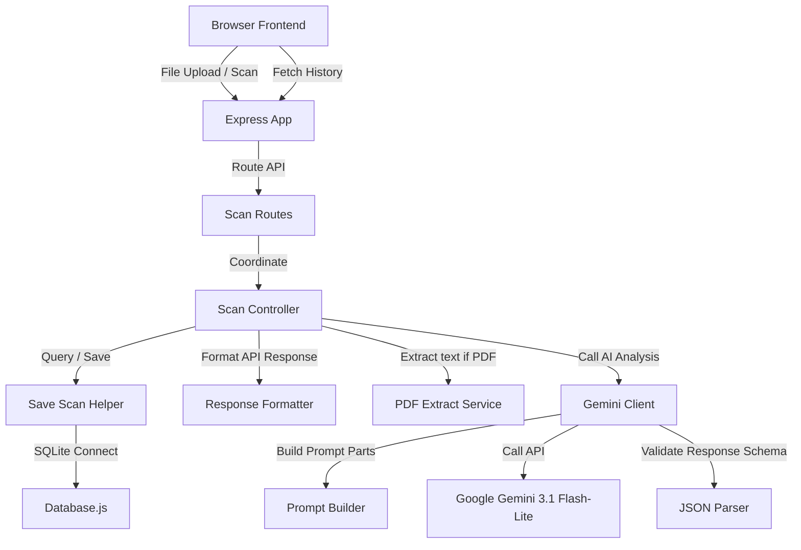

# LoanLens AI

LoanLens AI is a hackathon MVP designed to help people analyze loan agreements, estimate effective APR, and flag predatory lending clauses using Google Gemini.

## System Architecture

The application is structured as a decoupled Node.js/Express backend and a vanilla HTML/Bootstrap 5 frontend.



## Folder Structure

```text
LoanLensAI/
├── client/
│   ├── css/
│   │   └── style.css
│   ├── js/
│   │   ├── app.js
│   │   └── history.js
│   ├── assets/
│   │   └── .gitkeep
│   ├── index.html
│   └── history.html
├── server/
│   ├── config/
│   │   ├── constants.js
│   │   ├── dbConfig.js
│   │   └── geminiConfig.js
│   ├── controllers/
│   │   ├── responseFormatter.js
│   │   ├── saveScan.js
│   │   └── scanController.js
│   ├── database/
│   │   ├── database.js
│   │   └── initDb.js
│   ├── middleware/
│   │   └── uploadMiddleware.js
│   ├── routes/
│   │   └── scanRoutes.js
│   ├── services/
│   │   ├── extractPdfText.js
│   │   ├── geminiClient.js
│   │   ├── jsonParser.js
│   │   └── promptBuilder.js
│   ├── uploads/
│   │   └── .gitkeep
│   └── app.js
├── .env.example
├── .gitignore
├── package.json
└── README.md
```

## API Endpoints

### 1. Submit Scan
- **Endpoint**: `POST /api/scan`
- **Payload**: Multipart file upload (`file` key containing PDF, JPG, or PNG)
- **Output**: JSON payload matching output schema.

### 2. List History
- **Endpoint**: `GET /api/scans`
- **Output**: Array of past scans (ID, filename, risk score, date).

### 3. Fetch Scan Details
- **Endpoint**: `GET /api/scans/:id`
- **Output**: Full detailed JSON log of the scan.

## Deployment Guide (Render)

### Free Tier Deployment
1. Create a new Web Service on Render pointing to your repository.
2. Select **Node** runtime.
3. Use `npm install` for the Build Command, and `node server/server.js` for the Start Command.
4. Add environment variable `GEMINI_API_KEY` containing your Google AI Studio key.

### Persistent Database Deployment (Starter Tier)
1. Add a **Persistent Disk** on Render with Mount Path `/data`.
2. Configure environment variable `DATABASE_PATH` with value `/data/database.db`.

## How AI is Used
We connect to the `gemini-3.1-flash-lite` model. For text documents (PDFs), we extract raw text and prompt Gemini for structured analysis. For image uploads, we leverage multimodal inputs and upload raw image buffer bytes directly to Gemini to perform analysis. Gemini output is strictly parsed as JSON and validated prior to database insertion.

## Future Scope
- **Agentic AI Expansion**: Decoupled prompt building and client execution files make it easy to migrate to an agentic execution loop (e.g. self-correcting prompt loops).
- **OCR Fallback**: If standard PDF text extraction returns empty or fails, convert the PDF pages into image bytes and process them multimodally.
- **Scans Pagination**: Add pagination limit parameter to database query methods.
